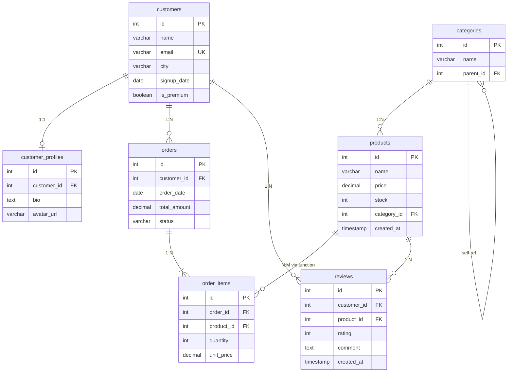

# SQL-DBA Learning Platform

DBA를 목표로 하는 학습자가 SQL 실력을 초보부터 전문가 수준까지 체계적으로 향상시킬 수 있는 웹 기반 학습 플랫폼입니다.
실제 PostgreSQL / MySQL 데이터베이스에 SQL을 실행하고, 즉시 채점과 설명을 받을 수 있습니다.

> **한국어 / English** 전환 지원 | **다크 / 라이트** 테마 | **PostgreSQL / MySQL** 선택 실행

---

## Architecture

### System Architecture

```mermaid
graph TB
    subgraph CLIENT["🖥️ Client Layer"]
        direction LR
        DASH["📊 Dashboard<br/><small>React 19 + Zustand</small>"]
        WORK["⌨️ SQL Workspace<br/><small>CodeMirror 6</small>"]
        DOCS["📖 Theory Docs<br/><small>react-markdown + SVG</small>"]
        CHAT["🤖 AI Chat<br/><small>AWS Bedrock</small>"]
    end

    subgraph API["⚡ Next.js 16 API Layer"]
        direction LR
        EXEC["/api/execute-sql"]
        RESET["/api/reset-db"]
        CHATAPI["/api/chat"]
    end

    subgraph LOGIC["🔧 Core Logic"]
        direction LR
        VALID["🛡️ SQL Validator<br/><small>Level-based permissions</small>"]
        GRADE["✅ Grading Engine<br/><small>exact / unordered / contains</small>"]
        STATE["📦 State Manager<br/><small>Zustand 5 + localStorage</small>"]
    end

    subgraph DB["🐳 Docker Compose"]
        direction LR
        PG["🐘 PostgreSQL 16"]
        MY["🐬 MySQL 8.0"]
    end

    CLIENT --> API
    API --> LOGIC
    LOGIC --> DB

    WORK --> EXEC
    EXEC --> VALID
    VALID --> PG
    VALID --> MY
    EXEC --> GRADE
    CHAT --> CHATAPI

    style CLIENT fill:#dbeafe,stroke:#3b82f6,color:#1e3a5f
    style API fill:#ede9fe,stroke:#8b5cf6,color:#3b1f7a
    style LOGIC fill:#fef3c7,stroke:#f59e0b,color:#78350f
    style DB fill:#d1fae5,stroke:#10b981,color:#064e3b
```



### SQL Execution Flow

```mermaid
graph LR
    A["✏️ SQL 작성<br/><small>CodeMirror 6</small>"] --> B["🛡️ 권한 검증<br/><small>Level-based</small>"]
    B --> C["🔀 DB 라우팅<br/><small>PG / MySQL</small>"]
    C --> D["💾 쿼리 실행<br/><small>Docker DB</small>"]
    D --> E["📊 결과 채점<br/><small>3 modes</small>"]
    E --> F["💬 피드백<br/><small>Score + Hint</small>"]

    style A fill:#dbeafe,stroke:#3b82f6,color:#1e3a5f
    style B fill:#fef3c7,stroke:#f59e0b,color:#78350f
    style C fill:#ede9fe,stroke:#8b5cf6,color:#3b1f7a
    style D fill:#d1fae5,stroke:#10b981,color:#064e3b
    style E fill:#ffe4e6,stroke:#f43f5e,color:#881337
    style F fill:#ccfbf1,stroke:#14b8a6,color:#134e4a
```



### Database Schema (ERD)



---

## Tech Stack

| Layer | Technology |
|-------|-----------|
| Framework | **Next.js 16** (App Router) + **TypeScript** |
| UI | **React 19** + **Tailwind CSS 4** + **shadcn/ui** (Radix) |
| SQL Editor | **CodeMirror 6** (`@codemirror/lang-sql`, one-dark theme) |
| Database | **PostgreSQL 16** + **MySQL 8.0** (Docker Compose) |
| State | **Zustand 5** (localStorage 영속화) |
| Docs Rendering | **react-markdown** + **remark-gfm** |
| i18n | Custom hook (한국어/영어) |
| Theme | **next-themes** (light/dark/system) |
| Icons | **Lucide React** |

---

## Quick Start

### Prerequisites

- **Node.js** 18+
- **Docker Desktop** (PostgreSQL + MySQL 컨테이너용)

### Installation

```bash
# 1. Clone & install
git clone <repository-url>
cd sql-create-dba
npm install

# 2. Start databases + dev server (한 번에)
npm run dev

# 3. Open browser
open http://localhost:3000
```

### Database Management

```bash
npm run db:start    # Docker 컨테이너만 시작
npm run db:stop     # 컨테이너 중지
npm run db:reset    # 데이터 초기화 (볼륨 삭제 후 재생성)
```

### Environment Variables

`.env.local` 파일이 프로젝트 루트에 필요합니다:

```env
PG_HOST=localhost
PG_PORT=5432
PG_DATABASE=sql_practice
PG_USER=sql_student
PG_PASSWORD=practice123

MYSQL_HOST=localhost
MYSQL_PORT=3306
MYSQL_DATABASE=sql_practice
MYSQL_USER=sql_student
MYSQL_PASSWORD=practice123

# AWS Bedrock (AI Chat Assistant)
AWS_BEDROCK_REGION=us-east-1
BEDROCK_MODEL_ID=us.anthropic.claude-sonnet-4-20250514-v1:0
```

---

## Project Structure

```
sql-create-dba/
├── src/
│   ├── app/                        # Next.js App Router
│   │   ├── api/
│   │   │   ├── chat/               # AI 챗봇 API (AWS Bedrock)
│   │   │   ├── execute-sql/        # SQL 실행 API
│   │   │   └── reset-db/           # DB 초기화 API
│   │   ├── docs/                   # 이론 문서 페이지
│   │   ├── levels/
│   │   │   └── [level]/
│   │   │       ├── page.tsx        # 레벨별 문제 목록
│   │   │       └── [problemId]/
│   │   │           └── page.tsx    # 문제 풀이 워크스페이스
│   │   ├── layout.tsx              # 루트 레이아웃
│   │   ├── page.tsx                # 대시보드 (랜딩)
│   │   └── providers.tsx           # 클라이언트 프로바이더
│   │
│   ├── components/
│   │   ├── chat/
│   │   │   └── ChatBot.tsx         # 플로팅 AI 챗봇 (AWS Bedrock)
│   │   ├── editor/                 # SQL 에디터 관련
│   │   │   ├── SqlEditor.tsx       # CodeMirror 6 에디터
│   │   │   ├── EditorToolbar.tsx   # 실행/초기화/힌트/채점 버튼
│   │   │   └── ResultTable.tsx     # 쿼리 결과 테이블
│   │   ├── home/                   # 홈페이지 다이어그램
│   │   │   ├── ArchitectureDiagram.tsx    # 인터랙티브 아키텍처
│   │   │   └── ExecutionFlowDiagram.tsx   # SQL 실행 흐름도
│   │   ├── problem/                # 문제 관련
│   │   │   ├── ProblemDescription.tsx
│   │   │   ├── ProblemList.tsx
│   │   │   ├── GradingResult.tsx
│   │   │   └── Explanation.tsx
│   │   ├── docs/
│   │   │   └── DocDiagrams.tsx     # 인터랙티브 SVG 다이어그램
│   │   ├── common/                 # DB/언어/테마 토글
│   │   ├── layout/                 # Header
│   │   ├── progress/               # LevelCard
│   │   └── ui/                     # shadcn/ui primitives
│   │
│   ├── data/
│   │   ├── problems/               # 70개 SQL 문제
│   │   │   ├── beginner/           # 15문제
│   │   │   ├── intermediate/       # 16문제
│   │   │   ├── advanced/           # 15문제
│   │   │   ├── expert/             # 16문제
│   │   │   └── database/           # 8문제
│   │   └── docs/
│   │       └── index.ts            # 이론 문서 (한/영, 22개 섹션)
│   │
│   ├── lib/
│   │   ├── db/                     # DB 엔진 (postgres-engine, mysql-engine)
│   │   ├── grading/                # 채점 로직 (exact, unordered, contains)
│   │   ├── safety/                 # SQL 검증 (레벨별 권한)
│   │   └── i18n/                   # 다국어 (ko, en)
│   │
│   ├── stores/                     # Zustand 스토어
│   │   ├── progress-store.ts       # 진행도 + 레벨 잠금
│   │   ├── settings-store.ts       # DB 엔진 선택
│   │   └── locale-store.ts         # 언어 설정
│   │
│   └── types/                      # TypeScript 타입
│       ├── problem.ts
│       └── progress.ts
│
├── docker/
│   ├── docker-compose.yml          # PostgreSQL 16 + MySQL 8.0
│   ├── postgres/init.sql           # PG 스키마 + 시드 데이터
│   └── mysql/init.sql              # MySQL 스키마 + 시드 데이터
│
└── generated-diagrams/             # 아키텍처 다이어그램 (PNG + drawio)
```

---

## Features

### SQL Editor

- **CodeMirror 6** 기반 문법 하이라이팅 + 자동완성
- **Ctrl+Enter** 단축키로 즉시 실행
- 선택 영역만 실행 가능
- PostgreSQL / MySQL 방언 자동 전환
- 다크/라이트 테마 연동 (one-dark / light)

### Problem System (70문제)

| Level | Problems | Topics |
|-------|----------|--------|
| **Beginner** | 15 | SELECT, WHERE, ORDER BY, LIMIT, COUNT/SUM/AVG, INSERT/UPDATE/DELETE |
| **Intermediate** | 16 | JOIN, Subquery, GROUP BY/HAVING, CREATE/DROP TABLE |
| **Advanced** | 15 | Window Functions, CTE, Views, CTAS, Materialized Views |
| **Expert** | 16 | Indexes, Transactions, Triggers, Sequences, Schema, Permissions |
| **Database** | 8 | VACUUM, Monitoring, Statistics, Performance Tuning |

- **자동 채점**: exact / unordered / contains 모드
- **점수 시스템**: 0~100점 (정확도 기반)
- **힌트 시스템**: 단계별 힌트 공개
- **풀이 설명**: 정답 후 관련 개념 설명
- **레벨 잠금**: 이전 레벨 80% 완료 시 다음 레벨 해제

### Theory Documentation (22개 섹션)

5개 챕터, 22개 섹션의 체계적인 SQL/DBA 이론 문서:

| Chapter | Sections |
|---------|----------|
| **Beginner** | SQL이란, 스키마/키, SELECT, WHERE, ORDER BY/LIMIT, 집계함수, DML |
| **Intermediate** | JOIN, 서브쿼리, 중급 DML/DDL |
| **Advanced** | 윈도우 함수, CTE, VIEW/UNION/ALTER TABLE |
| **Expert** | 인덱스/실행계획, 트랜잭션/제약조건, 스키마/시퀀스/트리거/권한, 함수/프로시저, 파티션 테이블, LOB/대용량 데이터 |
| **DBA** | VACUUM/유지보수, 모니터링/시스템 카탈로그 |

**인터랙티브 다이어그램** (React + SVG):

- **E-Commerce ERD** — 7개 테이블, 1:1/1:N/N:1/N:M 관계
- **PK/FK 연결 다이어그램** — 실제 데이터 예시로 관계 시각화
- **관계 유형 다이어그램** — 4가지 관계 타입 비교
- **JOIN 벤 다이어그램** — INNER/LEFT/RIGHT/FULL 시각화
- **SQL 실행 순서** — 작성 순서 vs 실행 순서
- **파티션 테이블** — RANGE/LIST/HASH 탭 전환
- **함수 vs 프로시저** — 실행 흐름 비교
- **LOB 저장 전략** — 데이터 크기별 4단계 티어

### Dual Database Engine

- **PostgreSQL 16** + **MySQL 8.0** 동시 운영
- UI 상단에서 원클릭 전환
- 각 문제에 PG/MySQL 양쪽 정답 쿼리 포함
- 문법 차이(SERIAL vs AUTO_INCREMENT 등) 학습 가능

### Safety & Isolation

- **레벨별 SQL 권한 제어** (초보: SELECT만 → 전문가: 거의 모든 것)
- **Query timeout**: 5초
- **DML 트랜잭션 래핑**: INSERT/UPDATE/DELETE 후 자동 롤백 방지
- **DDL 안전 실행**: 트랜잭션 래핑 (PG) / 별도 처리 (MySQL)
- **DROP DATABASE 차단**

### i18n (한국어/영어)

- 모든 UI 텍스트 + 70개 문제 + 22개 이론 섹션 완전 번역
- Zustand + localStorage로 설정 유지
- 원클릭 언어 전환

---

## Database Schema

E-Commerce 스키마를 사용합니다 (상세 ERD는 [Architecture](#database-schema-erd) 섹션 참조):

- 7개 테이블: `customers`, `customer_profiles`, `orders`, `order_items`, `products`, `categories`, `reviews`
- 관계: 1:1, 1:N, N:M (junction table), self-referencing
- 시드 데이터: ~50 customers, ~20 categories, ~100 products, ~500 orders, ~1200 order_items, ~300 reviews

---

## API Routes

### `POST /api/execute-sql`

SQL 쿼리를 선택한 DB 엔진에서 실행합니다.

```json
// Request
{
  "sql": "SELECT * FROM customers LIMIT 5;",
  "level": "beginner",
  "engine": "postgresql"
}

// Response (success)
{
  "success": true,
  "result": {
    "columns": ["id", "name", "email", "city"],
    "rows": [[1, "Kim", "kim@test.com", "Seoul"]],
    "rowCount": 1,
    "executionTime": 12
  }
}

// Response (error)
{
  "success": false,
  "error": "permission denied: DELETE is not allowed at beginner level"
}
```

### `POST /api/reset-db`

데이터베이스를 초기 상태로 복원합니다.

```json
// Request
{ "engine": "postgresql" }

// Response
{ "success": true }
```

---

## Grading System

| Mode | Description | Use Case |
|------|-------------|----------|
| **exact** | 행 순서 + 데이터 정확히 일치 | ORDER BY가 있는 SELECT |
| **unordered** | 행 순서 무관, 데이터 일치 | GROUP BY, 집합 연산 |
| **contains** | 영향받은 행 수 또는 부분 일치 | DML (INSERT/UPDATE/DELETE) |

점수 기준:

| Score | Condition |
|-------|-----------|
| 100 | 완전 정답 |
| 50 | 행 수 불일치 |
| 20 | 컬럼 불일치 |
| 10~80 | 부분 일치 (정답 행 비율) |

---

## State Management

3개의 Zustand 스토어가 localStorage에 영속화됩니다:

| Store | Key | Purpose |
|-------|-----|---------|
| `progress-store` | `sql-dba-progress` | 문제 완료 상태, 시도 횟수, 최고 쿼리, 레벨 잠금 해제 |
| `settings-store` | `sql-dba-settings` | DB 엔진 선택 (postgresql / mysql) |
| `locale-store` | `sql-dba-locale` | 언어 설정 (ko / en) |

---

## Scripts

```bash
npm run dev        # Docker 시작 + Next.js 개발 서버
npm run build      # 프로덕션 빌드
npm start          # 프로덕션 서버 실행
npm run lint       # ESLint 실행
npm run db:start   # Docker 컨테이너만 시작
npm run db:stop    # Docker 컨테이너 중지
npm run db:reset   # DB 볼륨 삭제 후 재생성
```

---

## License

Private
